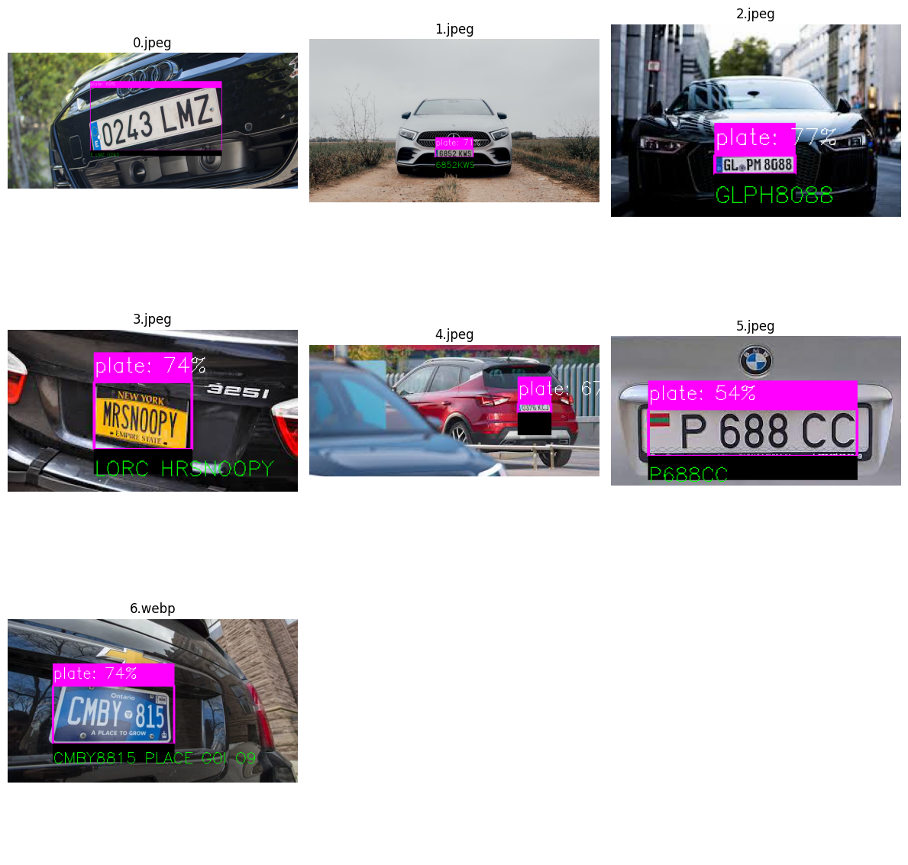

## Automatic Number Plate Recognition / YoloV5 + OCR (EasyOCR)

This project is a simple implementation of Automatic Number Plate Recognition (ANPR) using YoloV5 and EasyOCR. 

The project is divided into two parts:
1. Object Detection using YoloV5. Bounding boxes are drawn around the license plates and the images and annotations are saved in a separate folder.
```01_Dataprocessing+Training.ipynb```
2. Optical Character Recognition (OCR) using EasyOCR - Predictions. The images are loaded and the text is extracted from the license plates. The results are saved in a csv file.
```02_Predictions+ExtractText.ipynb```



### Dataset
https://www.kaggle.com/andrewmvd/car-plate-detection

### Contributing
This repository is for educational purposes only and is not intended to receive further contributions. 